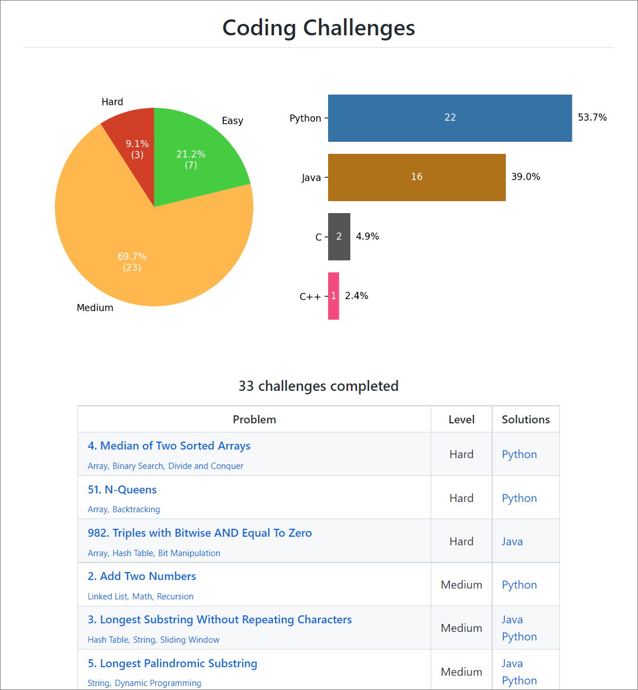

  
  <h1>Coding Challenge Companion</h1>

**Coding Challenge Companion** is a Chrome extension that automatically pushes your solutions to GitHub upon successful submission.

  <a href="https://chrome.google.com/webstore/detail/coding-challenge-companio/lkfbnbclahofpbalfjcccpdimjadbboj">
    <b>Click here to install the extension</b>
  </a>

 

## Features
### Colorful Metrics
After a solution is uploaded to GitHub, **Coding Challenge Companion** automatically displays colorful graphs to summarize your progress.

  

 

These graphs are also displayed in your coding challenge repository's `README.md` file, along with a catalog of challenges and your solutions:

  

### GitHub Integration
With the intuitive user interface, authenticating with GitHub and setting up your coding challenge repository is quick and easy!

  
    
  

