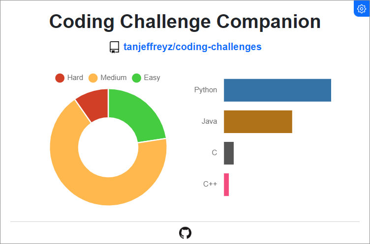
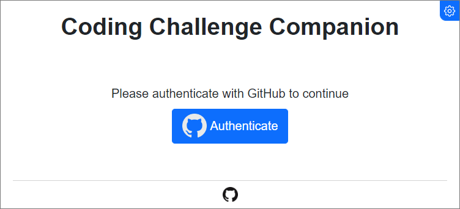
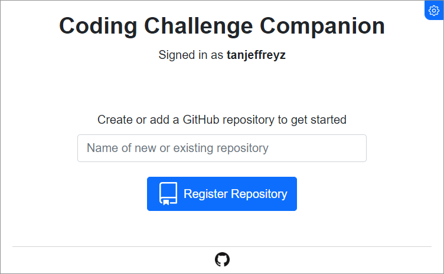

  
  <h1>Coding Challenge Companion</h1>

**Coding Challenge Companion** is a Chrome extension that automatically pushes your solutions to GitHub upon successful submission.

  <a href=""><b>Click here to install the extension</b></a>

 

## Features
### Colorful Metrics
As solutions are uploaded to GitHub, **Coding Challenge Companion** automatically generates colorful graphs to summarize your progress.

  

### GitHub Integration
With the intuitive user interface, authenticating with GitHub and setting up your challenge repositories is quick and easy!

  
    
  

